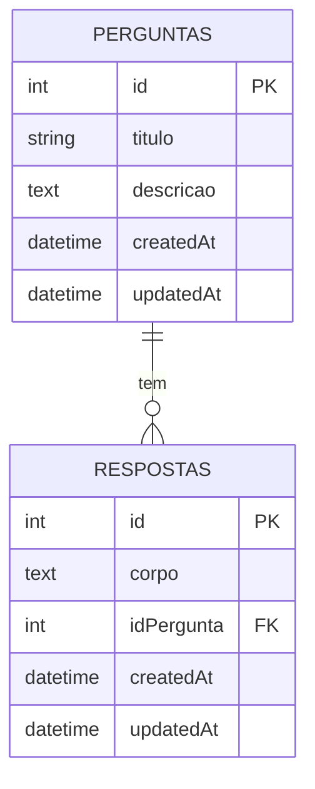

# **Quest Place**  

## **1. Descrição do Sistema**  
Plataforma web colaborativa onde usuários podem:  
-  Publicar perguntas técnicas/didáticas  
-  Responder perguntas de outros usuários  
-  Consultar perguntas e respostas existentes  

**Arquitetura**:  
- **Backend**: Node.js + Express  
- **Banco de Dados**: Sequelize, MySQL  
- **Frontend**: EJS + Bootstrap 5  

---

## **2. Funcionalidades**  

### **2.1 Gestão de Perguntas**  
| Funcionalidade          | Descrição                                 | Método HTTP | Rota                            |
|-------------------------|-------------------------------------------|-------------|---------------------------------|
| Cadastrar nova pergunta | Formulário com título e descrição         | GET/POST    | /perguntar → /armazenarPergunta |
| Listar perguntas        | Exibição ordenada por data (descendente)  | GET         | /                               |
| Detalhes da pergunta    | Visualização completa com respostas       | GET         | /respostas/:id                  |

### **2.2 Gestão de Respostas**  
| Funcionalidade       | Descrição                              | Método HTTP | Rota                  |
|----------------------|---------------------------------------|-------------|-----------------------|
| Enviar resposta      | Formulário associado à pergunta       | POST        | /armazenarResposta    |

---

## **3. Estrutura de Rotas

| Método | Rota                | Descrição                                              |
|--------|---------------------|--------------------------------------------------------|
| GET    | `/`                 | Exibe todas as perguntas cadastradas                   |
| GET    | `/perguntar`        | Exibe o formulário para criar uma nova pergunta        |
| POST   | `/armazenarPergunta`| Salva uma nova pergunta no banco de dados              |
| GET    | `/respostas/:id`    | Exibe detalhes da pergunta e todas as respostas        |
| POST   | `/armazenarResposta`| Salva uma resposta vinculada à pergunta                |

### Exemplos

- **Listar perguntas**
  ```
  GET / 
  ```
- **Criar pergunta**
  ```
  GET /perguntar
  POST /armazenarPergunta
  ```
- **Visualizar pergunta e respostas**
  ```
  GET /respostas/:id
  ```
- **Responder pergunta**
  ```
  POST /armazenarResposta
  ```

> Todas as rotas retornam páginas renderizadas via EJS.

## **4. Modelagem de Dados**  

### **4.1 Diagrama Entidade-Relacionamento**  

---

### **4.2 Esquema do Banco**

**Tabela `perguntas`**

| Campo     | Tipo         | Descrição                         | Restrições                                              |
| --------- | ------------ | --------------------------------- | ------------------------------------------------------- |
| id        | INT          | Identificador único da pergunta   | PRIMARY KEY, AUTO\_INCREMENT                            |
| titulo    | VARCHAR(255) | Título da pergunta                | NOT NULL                                                |
| descricao | TEXT         | Conteúdo detalhado da pergunta    | NOT NULL                                                |
| createdAt | DATETIME     | Data e hora de criação            | DEFAULT CURRENT\_TIMESTAMP                              |
| updatedAt | DATETIME     | Data e hora da última atualização | DEFAULT CURRENT\_TIMESTAMP ON UPDATE CURRENT\_TIMESTAMP |

**Tabela `respostas`**

| Campo      | Tipo     | Descrição                         | Restrições                                              |
| ---------- | -------- | --------------------------------- | ------------------------------------------------------- |
| id         | INT      | Identificador único da resposta   | PRIMARY KEY, AUTO\_INCREMENT                            |
| corpo      | TEXT     | Texto da resposta                 | NOT NULL                                                |
| idPergunta | INT      | Chave estrangeira para pergunta   | FOREIGN KEY (`id`) de `perguntas`, NOT NULL             |
| createdAt  | DATETIME | Data e hora de criação            | DEFAULT CURRENT\_TIMESTAMP                              |
| updatedAt  | DATETIME | Data e hora da última atualização | DEFAULT CURRENT\_TIMESTAMP ON UPDATE CURRENT\_TIMESTAMP |

---

## **5. Guia de Instalação**  

### Pré-requisitos
- Node.js v18+
- npm v9+
- Banco de dados MySQL ou PostgreSQL

### Passo a Passo

```bash
# 1. Clone o repositório
git clone https://github.com/seu-usuario/seu-repositorio.git

# 2. Instale as dependências
npm install

# 3. Configure o banco de dados
# Edite o arquivo databases/database.js com suas credenciais

# 4. Inicie o servidor
node index.js
```
---

## **6. Stack Tecnológico**  

### **6.1 Dependências Principais**  
| Pacote       | Versão  | Finalidade                  |
|--------------|---------|-----------------------------|
| express      | ^4.18.2 | Framework web               |
| sequelize    | ^6.35.1 | ORM para banco de dados     |
| ejs          | ^3.1.9  | Template engine             |
| mysql2       | ^3.6.0  | Driver MySQL                |

### **6.2 Estrutura do Projeto**  
```
perguntas/
│
├── index.js                # Arquivo principal do servidor Express
├── package.json            # Dependências e scripts do projeto
│
├── databases/              # Modelos e configuração do banco de dados
│   ├── database.js         # Conexão com o MySQL
│   ├── questions.js        # Modelo Perguntas (Sequelize)
│   └── resposta.js         # Modelo Respostas (Sequelize)
│
├── views/                  # Templates EJS
│   ├── index.ejs           # Página inicial (lista perguntas)
│   ├── perguntar.ejs       # Formulário para nova pergunta
│   ├── respostas.ejs       # Página de respostas de uma pergunta
│   └── partials/           # Partes reutilizáveis (header, nav, footer)
│       ├── header.ejs
│       ├── nav.ejs
│       └── footer.ejs
│
├── public/                 # Arquivos estáticos (CSS, JS, Bootstrap)
│   └── ...                 # (bootstrap, imagens, etc.)
│
└── README.md           
```

---

## **7. Melhorias Futuras (Roadmap)**  

### **7.1 Prioridades**  
-  **Autenticação de Usuários** (JWT/OAuth)  
-  **Colocar Imagens nas Perguntas  

---

**Contato**:  
📧 pedrorenanmesquitabrasil@gmail.com   
